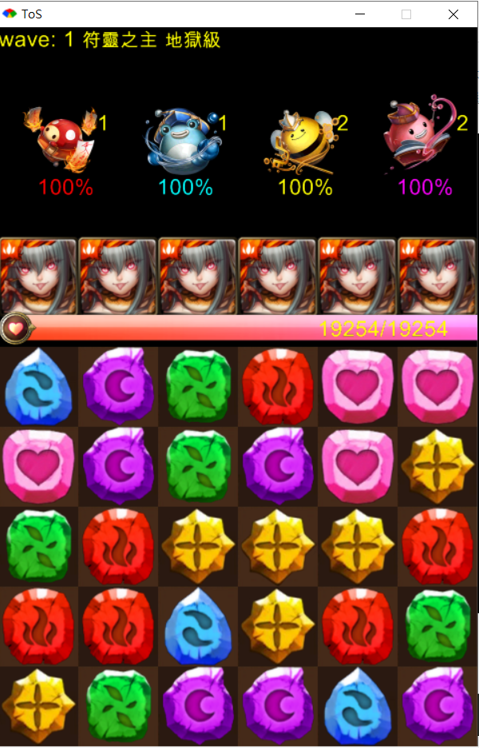

# Tower of Saviors Simulator

## Overview

### Features

- Simulate battles with various team setups

## Requirements

- Ruby 2.6 or later
- `gosu` gem Getting Started on macOS
- SDL2 library (required by `gosu`)

Follow these steps to set up and run the project:
1. `brew install sdl2`
2. `bundle install`
3. `ruby main.rb`
